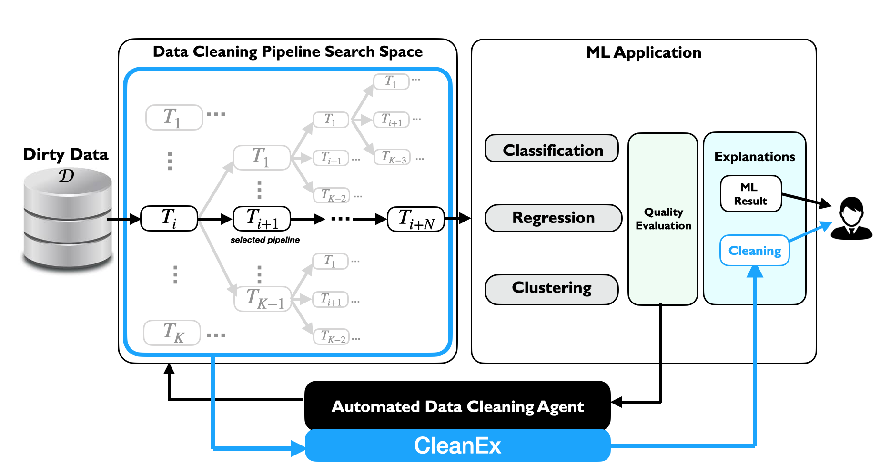
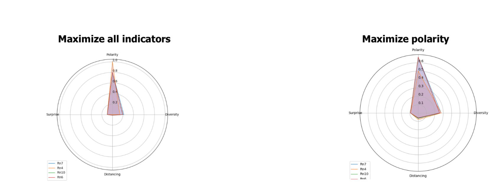

# CleanEx
## Explaining data cleaning pipelines



CLeanEX is a solution implemented in Python that can generate explanations for the selected data cleaning pipelines that are generated automatically by an automated cleaning system. Given a large cleaning pipeline search space, CLeanEX propses meaningful explanatory features to describe the pipelines and generate predicate-based explanation rules. 
It computes quality indicators for these explanations and propose a multi-objective optimization algorithm to select the optimal set of explanations for user-defined objectives. 

Our preliminary experiments show the need for multi-objective optimization for the generation of high-quality explanations that can be either intrinsic to the single selected cleaning pipeline or relative to the other data cleaning and preprocessing pipelines that may not have been selected by the automated cleaning system.

We also show that CLeanEX is a promising step towards generating automatically insightful explanations, while catering to the needs of the user alike.

**For more details**, please refer to the paper: 

- Laure Berti-Equille and Ugo Comignani. Explaining Automated Data Cleaning with CLeanEX. Proceedings of IJCAI-PRICAI 2020 Workshop on Explainable Artificial Intelligence ([XAI](https://sites.google.com/view/xai2020/)). [Preprint](https://drive.google.com/file/d/1s2N7SlxVptn96yfhLJiJnd5RW0JJlGC_/view)

--------------------------

Installation and Usage
=================

#### 1. Download or clone CleanEx repo

#### 2. If needed, please install the required packages 

Using pip: numpy, scipy, functools, skcriteria, skcriteria.madm, pandas, matplotlib.pyplot, math, os, sys, csv

#### 3. Run CleanEX using the following command line from your terminal

``python cleanex.py ./experiments/treeStruct.csv ./experiments/treeFeatures.csv "root" -o ./experiments/out.csv -f  "n7" -m "1,0,0,0"
``


where:
* two input files are required and placed in the `./experiments` folder: they  describe the full cleaning pipeline (with all alternative cleaning strategies explored with an automated data curation system): 1) `treeStruct.csv` stores the structure of the cleaning pipeline space represented as a tree, and 2) `treeFeatures.csv` gives the description of each node (or step of each cleaning strategy) with the following headers:
    - `cost`: The normalized cost of the cleaning strategy
    - `data quality improvement` *(dq_imp)*: The percentage of data quality problems solved by the pipeline (e.g., remove 100% of missing values by imputation)
    - `distortion` *(dist)*: The statistical distortion as the Mahalanobis distance between the original and cleaned version of the data set
    - `satisfaction` *(sat)*: The satisfaction of ML model requirements by the pipeline defined as a Boolean: e.g., for regression, satisfaction equals 1 if linearity, multivariate normality, no or little multicollinearity, no auto-correlation, and homoscedasticity constraints are satisfied by the cleaned data set
    - `corr_ratio`: The fraction of the number of pipelines sharing the same tasks over the sum of their respective ranks and the total number of explored pipelines, and
    - `non_corr_ratio`: The fraction of the number of pipelines that do not share the same task over the sum of their respective ranks and the total number of explored pipelines 
* the output file is `out.csv` in the `./experiments` folder using `-o` option
* the generation of explanations starts from the `root` to the leaf node `n7` (with `-f` option for specifying the final node) 
* the multi-objective optimization is defined  `1,0,0,0` and indicates that the only criterion considered for optimization is *polarity*. 

Cleanex considers four dimensions of quality for the generated explanations: polarity, distancing, surprise, and diversity of the explanations (See our paper for a formal definition of each dimension). 

#### 4. Check the output file

Finally, CleanEx select the optimal explanations of the specified data cleaning strategy (n7) and store them in the output file `out.csv`. The kind of explanation rules we can obtain are the following:

```
P6: succ(root,n7)
C58: increase(cost,root,n7) /\ delta(cost,root,n7,0.332)
C71: most([corr_ratio,dq_imp],root)
C81: least([non_corr_ratio],root)
C160: least([sat],n7)
```


Basically, what it means, in natural language is that the choice of the cleaning strategy from `root` to  `n7` (P6) is best explained by polarity (favouring the extreme explanations). More specifically: despite the increasing cost of the cleaning strategy (C58),  the data quality improvement and the number of cleaning tasks commonly shared with all the other pipelines are maximal (C71), the number of uncommon tasks (C81) and the satisfaction are minimal (C160).


#### 5. Visualization
You can also visualize the explanation quality as radar plots.



--------------------------

Licence
=================

CLeanEx and the content of this repository are licensed under the BSD 2-Clause.
